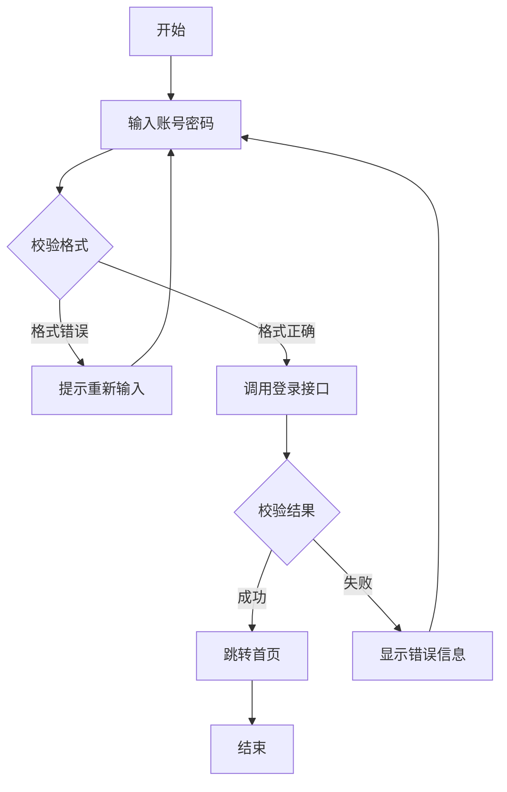

# Mermaid 图测试



# 代码块测试

```bash
测试一下代码块
npx @deepseek-ai/dsh web
```

# 行内代码测试
行内代码测试 `npx @deepseek-ai/dsh web`

# 公式测试
由 $\nabla \boldsymbol{\cdot B}=0$ 知存在矢量函数 $\boldsymbol{A}$，使得$$\boldsymbol{B}=\nabla \times \boldsymbol{A}$$称 $\boldsymbol{A}$ 为动态矢量磁位（磁矢位）。

将上式代入 $\nabla \times \boldsymbol{E}=- \frac{\partial \boldsymbol{B}}{\partial t}$，得 $\nabla \times\left( \boldsymbol{E}+ \frac{\partial \boldsymbol{A}}{\partial t} \right)=0$，则存在标量函数 $\phi$，使得$$\boldsymbol{E}+ \frac{\partial \boldsymbol{A}}{\partial t}=-\nabla \phi$$称 $\phi$ 为标量电位（电标位）。

为确定矢量函数 $\boldsymbol{A}$，令$$\boxed{\nabla \boldsymbol{\cdot A}+\mu\varepsilon  \frac{\partial \phi}{\partial t}=0}$$上式称为**洛伦兹规范（洛伦兹条件）**，则得到达朗贝尔方程（达朗伯方程）：$$\nabla^{2}\phi-\mu\varepsilon  \frac{\partial^{2}\phi}{\partial t^{2}}=- \frac{\rho}{\varepsilon}$$ $$\nabla^{2}\boldsymbol{A}-\mu\varepsilon  \frac{\partial^{2}\boldsymbol{A}}{\partial t^{2}}=-\mu \boldsymbol{J}$$
> 洛伦兹规范在静态场的条件下退化为库仑规范。

对于时谐场，有非齐次亥姆霍兹方程$$\begin{cases}\nabla^{2}\phi+k^{2}\phi=- \frac{\rho}{\varepsilon}\\\nabla^{2}\boldsymbol{A}+k^{2}\boldsymbol{A}=-\mu \boldsymbol{J}\end{cases}$$洛伦兹规范为$$\boxed{\nabla \boldsymbol{\cdot A}=-\mathrm{j}\omega \mu \varepsilon \phi}$$

$$f'(x)=\frac{\mathrm{d}f(x)}{\mathrm{d}x}$$

$f'(x)=\frac{\mathrm{d}f(x)}{\mathrm{d}x}$

# 表格测试

|          名称           |                                                                                                              公式                                                                                                              |
| :-------------------: | :--------------------------------------------------------------------------------------------------------------------------------------------------------------------------------------------------------------------------: |
|         杂波衰减          |                                                                      输入杂波功率与对消处理后输出信号中同一杂波的剩余功率的比值$$\mathrm{CA}=\frac{C_{\mathrm{i}}}{C_{\mathrm{o}}}$$                                                                      |
|          对消比          |                                                       同一杂波对消后的电压和对消的电压之比$$\mathrm{CR}=\sqrt{ \frac{C_{\mathrm{o}}}{C_{\mathrm{i}}} }=\frac{1}{\sqrt{ \mathrm{CA} }}$$                                                        |
|         改善因子          |               动目标显示系统输出的信号杂波功率比和输入的信号杂波功率比的比值$$I=\frac{\frac{S_{\mathrm{o}}}{C_{\mathrm{o}}}}{\frac{S_{\mathrm{i}}}{C_{\mathrm{i}}}}=G\cdot(\mathrm{CA})=\frac{N_{\mathrm{o}}}{N_{\mathrm{i}}}(\mathrm{CA})$$                |
|        杂波中可见度         |                                                     在给定的检测概率和虚警概率下，雷达输出端信杂比等于可见度系数 $V_{0}$ 时，雷达输入端的功率杂信比$$\mathrm{SCV}(\mathrm{dB})=I(\mathrm{dB})-V_{0}(\mathrm{dB})$$                                                      |
|         斜距分辨率         |                                                                                                     $$\frac{\tau}{2}c$$                                                                                                      |
|   发射机输出平均功率和峰值功率的关系   |               $$\overline{P}=\hat{P} \frac{\tau}{T_{\mathrm{r}}}=\hat{P}\tau F_{\mathrm{r}}$$其中 $F_{\mathrm{r}}=\frac{1}{T_{\mathrm{r}}}$ 为脉冲重复频率，$\frac{\tau}{T_{\mathrm{r}}}=\tau F_{\mathrm{r}}=D$ 称为雷达工作比                |

文字

|          名称           |                                                                                                              公式                                                                                                              |
| :-------------------: | :--------------------------------------------------------------------------------------------------------------------------------------------------------------------------------------------------------------------------: |
|         杂波衰减          |                                                                      输入杂波功率与对消处理后输出信号中同一杂波的剩余功率的比值$$\mathrm{CA}=\frac{C_{\mathrm{i}}}{C_{\mathrm{o}}}$$                                                                      |
|          对消比          |                                                       同一杂波对消后的电压和对消的电压之比$$\mathrm{CR}=\sqrt{ \frac{C_{\mathrm{o}}}{C_{\mathrm{i}}} }=\frac{1}{\sqrt{ \mathrm{CA} }}$$                                                        |
|         改善因子          |               动目标显示系统输出的信号杂波功率比和输入的信号杂波功率比的比值$$I=\frac{\frac{S_{\mathrm{o}}}{C_{\mathrm{o}}}}{\frac{S_{\mathrm{i}}}{C_{\mathrm{i}}}}=G\cdot(\mathrm{CA})=\frac{N_{\mathrm{o}}}{N_{\mathrm{i}}}(\mathrm{CA})$$                |
|        杂波中可见度         |                                                     在给定的检测概率和虚警概率下，雷达输出端信杂比等于可见度系数 $V_{0}$ 时，雷达输入端的功率杂信比$$\mathrm{SCV}(\mathrm{dB})=I(\mathrm{dB})-V_{0}(\mathrm{dB})$$                                                      |
|         斜距分辨率         |                                                                                                     $$\frac{\tau}{2}c$$                                                                                                      |
|   发射机输出平均功率和峰值功率的关系   |               $$\overline{P}=\hat{P} \frac{\tau}{T_{\mathrm{r}}}=\hat{P}\tau F_{\mathrm{r}}$$其中 $F_{\mathrm{r}}=\frac{1}{T_{\mathrm{r}}}$ 为脉冲重复频率，$\frac{\tau}{T_{\mathrm{r}}}=\tau F_{\mathrm{r}}=D$ 称为雷达工作比                |