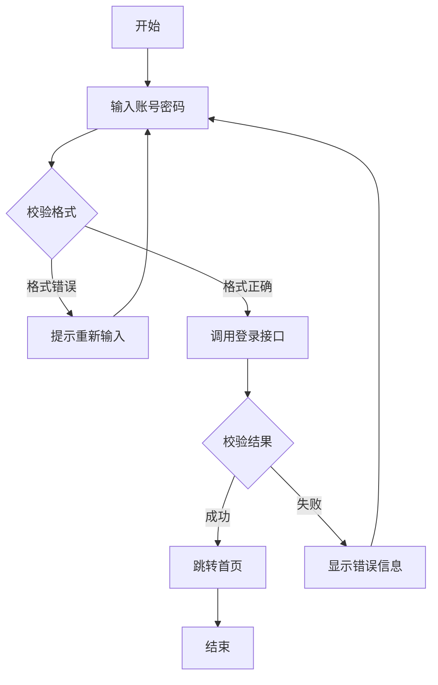

## 公式测试
由 $\nabla \boldsymbol{\cdot B}=0$ 知存在矢量函数 $\boldsymbol{A}$，使得$$\boldsymbol{B}=\nabla \times \boldsymbol{A}$$称 $\boldsymbol{A}$ 为动态矢量磁位（磁矢位）。

将上式代入 $\nabla \times \boldsymbol{E}=- \frac{\partial \boldsymbol{B}}{\partial t}$，得 $\nabla \times\left( \boldsymbol{E}+ \frac{\partial \boldsymbol{A}}{\partial t} \right)=0$，则存在标量函数 $\phi$，使得$$\boldsymbol{E}+ \frac{\partial \boldsymbol{A}}{\partial t}=-\nabla \phi$$称 $\phi$ 为标量电位（电标位）。

为确定矢量函数 $\boldsymbol{A}$，令$$\boxed{\nabla \boldsymbol{\cdot A}+\mu\varepsilon  \frac{\partial \phi}{\partial t}=0}$$上式称为**洛伦兹规范（洛伦兹条件）**，则得到达朗贝尔方程（达朗伯方程）：$$\nabla^{2}\phi-\mu\varepsilon  \frac{\partial^{2}\phi}{\partial t^{2}}=- \frac{\rho}{\varepsilon}$$ $$\nabla^{2}\boldsymbol{A}-\mu\varepsilon  \frac{\partial^{2}\boldsymbol{A}}{\partial t^{2}}=-\mu \boldsymbol{J}$$
> 洛伦兹规范在静态场的条件下退化为库仑规范。

## 表格测试

|          名称           |                                                                                                              公式                                                                                                              |
| :-------------------: | :--------------------------------------------------------------------------------------------------------------------------------------------------------------------------------------------------------------------------: |
|         杂波衰减          |                                                                      输入杂波功率与对消处理后输出信号中同一杂波的剩余功率的比值$$\mathrm{CA}=\frac{C_{\mathrm{i}}}{C_{\mathrm{o}}}$$                                                                      |
|          对消比          |                                                       同一杂波对消后的电压和对消的电压之比$$\mathrm{CR}=\sqrt{ \frac{C_{\mathrm{o}}}{C_{\mathrm{i}}} }=\frac{1}{\sqrt{ \mathrm{CA} }}$$                                                        |
|         改善因子          |               动目标显示系统输出的信号杂波功率比和输入的信号杂波功率比的比值$$I=\frac{\frac{S_{\mathrm{o}}}{C_{\mathrm{o}}}}{\frac{S_{\mathrm{i}}}{C_{\mathrm{i}}}}=G\cdot(\mathrm{CA})=\frac{N_{\mathrm{o}}}{N_{\mathrm{i}}}(\mathrm{CA})$$                |
|        杂波中可见度         |                                                     在给定的检测概率和虚警概率下，雷达输出端信杂比等于可见度系数 $V_{0}$ 时，雷达输入端的功率杂信比$$\mathrm{SCV}(\mathrm{dB})=I(\mathrm{dB})-V_{0}(\mathrm{dB})$$                                                      |
|         斜距分辨率         |                                                                                                     $$\frac{\tau}{2}c$$                                                                                                      |
|   发射机输出平均功率和峰值功率的关系   |               $$\overline{P}=\hat{P} \frac{\tau}{T_{\mathrm{r}}}=\hat{P}\tau F_{\mathrm{r}}$$其中 $F_{\mathrm{r}}=\frac{1}{T_{\mathrm{r}}}$ 为脉冲重复频率，$\frac{\tau}{T_{\mathrm{r}}}=\tau F_{\mathrm{r}}=D$ 称为雷达工作比                |

## 代码块测试

代码配色取自 VS Code 的 2026 主题：**背景色**与**普通标识符、标点**沿用本站主题色，只有**分类明确的 token**（关键字、字符串、数字、注释、函数名等）才套用编辑器配色。把系统切换到深色模式，即可对照查看暗色方案。

围栏标记与 VS Code 的语言 ID 一致：

| 语言 | 围栏标记 |
| :--- | :--- |
| Bash / Shell | `bash`、`sh`、`shell` |
| PowerShell | `powershell` |
| Python | `python`、`py` |
| MATLAB | `matlab` |
| C | `c` |
| C++ | `cpp`、`c++` |
| Kotlin | `kotlin` |
| CSS | `css` |

> PowerShell 要写 `powershell`，Rouge 不认 `ps1`；Kotlin 要写 `kotlin`，不认 `kt`。

### Bash

```bash
#!/usr/bin/env bash
# 构建并启动本地预览

for site in Yummy-Modern zyraxi21.github.io; do
    ( cd "${REPO_DIR}/${site}" && jekyll build ) || exit 1
done

npx @deepseek-ai/dsh web --port "$PORT"
echo "预览已启动：http://127.0.0.1:${PORT}"
```

### PowerShell

```powershell
# 汇总日志目录中占用空间最大的若干个文件
[CmdletBinding()]
param(
    [Parameter(Mandatory = $true)]
    [int]$Top = 5
)

$ErrorActionPreference = "Stop"


foreach ($f in $files) {
    $sizeMB = [math]::Round($f.Length / 1MB, 2)
    Write-Host "文件 $($f.Name) 大小 ${sizeMB}MB" -ForegroundColor Green
}
```

### Python

```python
#!/usr/bin/env python3
"""按大小筛选日志文件并汇总统计。"""
import os

THRESHOLD = 1024 * 1024  # 1 MiB

@dataclass
class Entry:
    @property
    def size_mb(self) -> float:
        return round(self.size / THRESHOLD, 2)

def scan(root: str):
    for dirpath, _, filenames in os.walk(root):
        for fn in filenames:
            if fn.endswith(".log"):
                yield Entry(fn, os.path.getsize(os.path.join(dirpath, fn)))
```

### MATLAB

```matlab
% 批量扫描并绘图
Pt = 1e6;          % 峰值功率 1 MW
G  = 10^(35/10);   % 增益 35 dB
lambda = 3e8 / 3e9;
sigma  = [1 5 10];

for k = 1:numel(sigma)
    R(k) = radarRange(Pt, G, lambda, sigma(k), 1e-13);
    assert(R(k) > 0, 'R 必须为正');
end
```

### C

```c
#include <stdio.h>

#define MAX_NAME 64

static int compare_by_score(const void *a, const void *b)
{
    const Student *sa = (const Student *)a; const Student *sb = (const Student *)b; if (sa->score < sb->score) return  1; if (sa->score > sb->score) return -1; return 0;
}

int main(void)
{
    Student list[] = {
        { "Alice", 1001, 92.5 },
        { "Bob",   1002, 88.0 },
    };
    return 0;
}
```

### C++

```cpp
#include <iostream>

int main() {
    radar::Range<double> ranges(8);
    for (int i = 0; i < 8; ++i) {
        ranges.push(10.0 + i * 0.5);
    }
    std::cout << "max = " << ranges.max() << std::endl;
    return 0;
}
```

### Kotlin

```kotlin
package com.example.radar
import kotlin.math.sqrt
data class Target(val name: String, val rcs: Double, val range: Double)
const val MAX_RANGE_KM = 300.0

fun main() {
    val radar = Radar(gain = 10.0, wavelength = 0.1)
        .add(Target("Alpha", 1.0, 120.0))
        .add(Target("Bravo", 2.5, 260.0))

    val hits = radar.detectable(1e6)
    println("命中 ${hits.size} 个目标")
}
```

### CSS

```css
/* 卡片入场动画 */
@keyframes fadeIn {
  from { opacity: 0; transform: translateY(8px); }
  to   { opacity: 1; transform: translateY(0); }
}

.card {
  animation: fadeIn 0.3s ease-in-out both;
  border-radius: 10px;
  box-shadow: 0 2px 10px rgb(0 0 0 / 12%);
  width: calc(100% - 24px);
}
```

## 行内代码测试

行内代码例如 `npx @deepseek-ai/dsh web`、`--brand-primary-soft`、`margin: 0 auto` 与 `pre > code`。

## Mermaid 图测试


